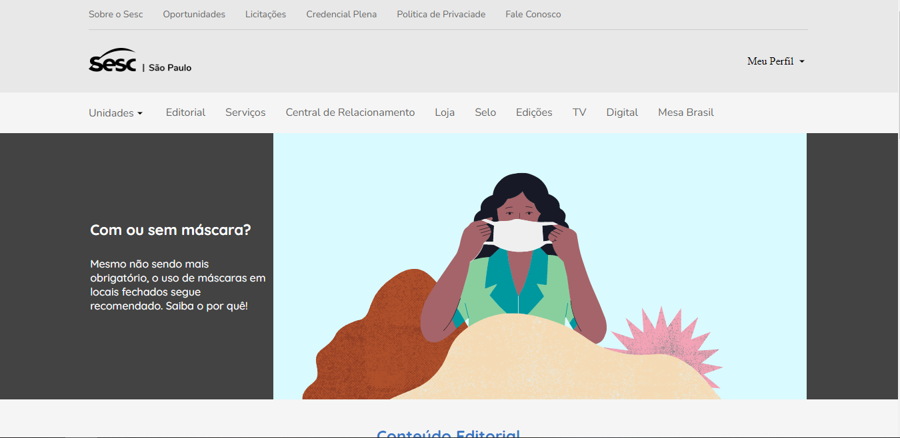

<h1 align="center">
   Pagina inicial Sesc SP - Clone
</h1>

<h4 align="center">
  Projeto criado com o intuito de aprimorar meus conhecimentos nas tecnologias HTML, CSS e Js.
</h4>

<h5 align="center">
  🛠️ Em construção 
</h5>

## 📚 Seções
O projeto é composto por uma pagina que contem 4 seções principais:

- **Carousel:** Imagens com os principais eventos;
- **Conteúdo Editorial:** -----------------------;
- **Destaques da Programção:** Principais eventos;
- **Mais ações:** Eventos diversos;

---

## 💼 Tecnologias utilizadas
Para o desenvolvimento deste projeto utilizei as seguintes tecnologias:

- HTML;
- CSS;
- Js;
---

#### Autor
Willian Stephano